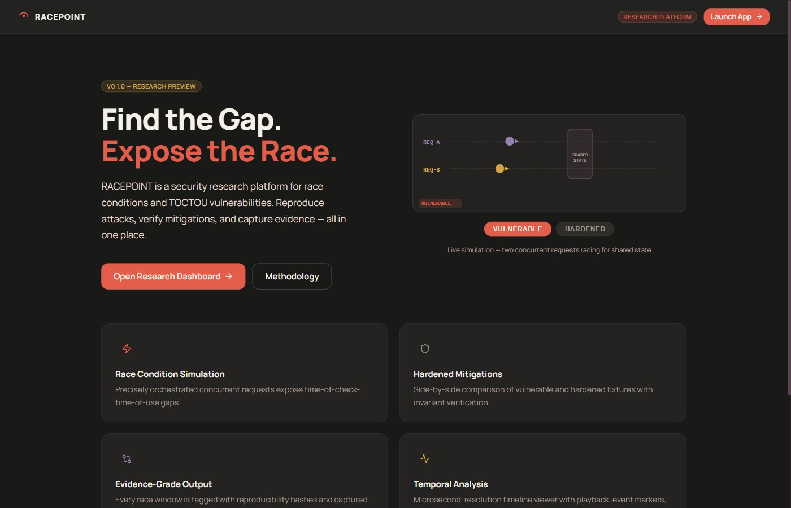
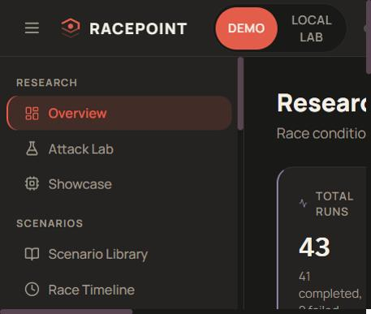
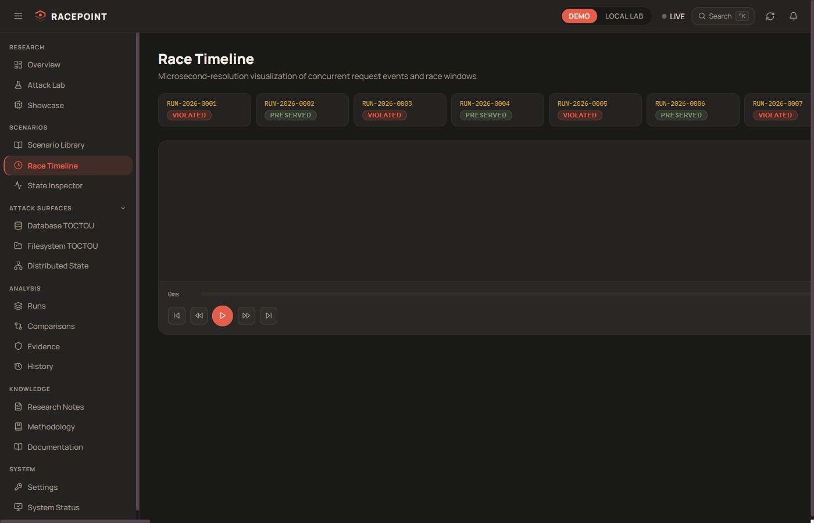
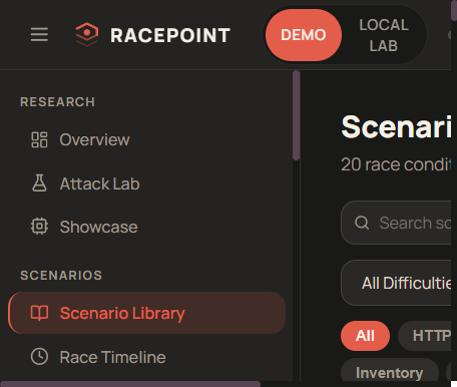
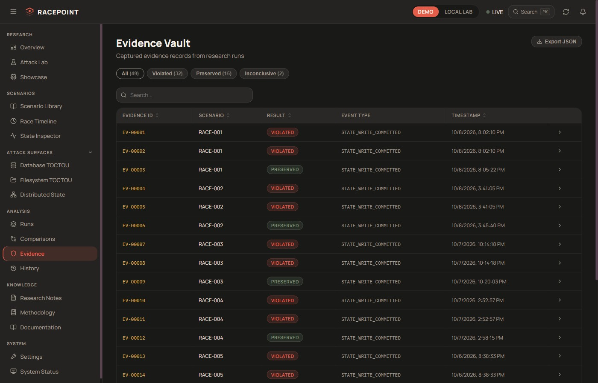
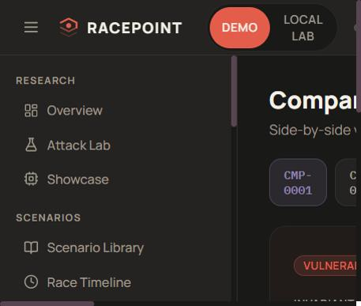
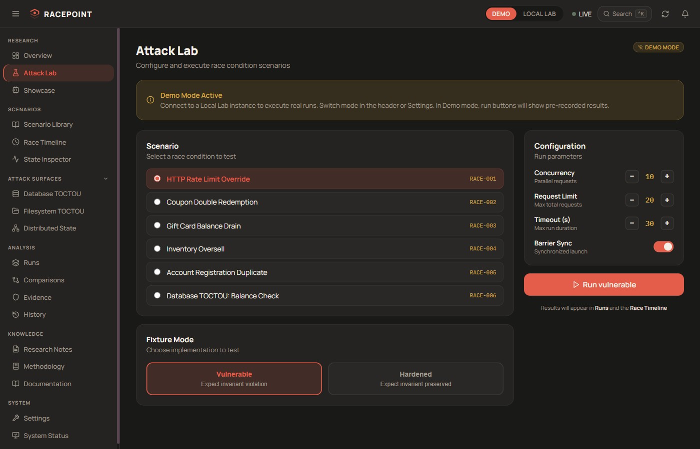
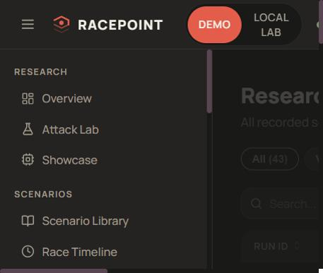

<div align="center">

<h1>⚡ RACEPOINT</h1>

<p><strong>Race Condition & TOCTOU Security Research Platform</strong></p>

<p><em>Find the gap. Expose the race. Harden the fix.</em></p>

<p>
  
  
  
  
  
  
  
  
  
</p>

</div>

---

## What Is RACEPOINT?

RACEPOINT is a **security research platform** built to make concurrency vulnerabilities visible, reproducible, and teachable. It covers 20 distinct race condition and TOCTOU attack patterns — from HTTP balance manipulation to distributed priority-queue bypass — with paired **vulnerable and hardened fixture implementations** written in Python asyncio.

Every vulnerability has a name, a scenario, real exploit evidence, and a side-by-side comparison showing exactly what the mitigation changes and why it works.

---

## Screenshots

<div align="center">

<br/>
<sub><b>Landing page — RACEPOINT Research Platform v0.1.0</b></sub>
</div>

<br/>

 

> **Left — Research Dashboard:** Live metrics from 43 research runs across 20 scenarios. Violation rate, race-window counts, evidence density, comparison coverage.  
> **Right — Race Timeline:** Frame-accurate request replay with scrubable playback. Race windows highlighted between concurrent check-and-act operations.

<br/>

 

> **Left — Scenario Library:** 20 curated race conditions organized by category with CWE classification, CVSS severity, and technical breakdown.  
> **Right — Evidence Vault:** 49 captured evidence records with per-result filter chips (Violated / Preserved / Inconclusive) and JSON export.

<br/>

 

> **Left — Vulnerability Comparisons:** 16 side-by-side comparisons of vulnerable vs hardened runs. Race-window counts, runtime deltas, mitigation type, prose analysis.  
> **Right — Attack Lab:** Live execution engine. Pick a scenario, choose vulnerable or hardened mode, configure concurrency, fire.

<br/>

<div align="center">

<br/>
<sub><b>Research Runs — 43 recorded executions with result filter chips and JSON export</b></sub>
</div>

---

## Key Features

### Concurrency Engine
- Python `asyncio.Barrier`-based coordinator launches all workers at the exact same instant
- Monotonic-clock event recording captures sub-millisecond timing of every operation
- Race-window detection measures the open gap between `check` and `act` across concurrent requests
- Invariant checker verifies post-run state for correctness (balance floor, uniqueness, atomicity)

### Interactive Race Timeline
- Per-request swimlane rendering on an HTML Canvas
- Scrubable playback with frame-step controls
- Race-window overlays drawn between the earliest READ and the last WRITE in a concurrent group
- Event markers with hover detail: REQUEST_START, BALANCE_READ, BALANCE_WRITE, RESPONSE_OK, RESPONSE_ERR

### Vulnerable + Hardened Fixtures

Every scenario ships two Python fixture implementations:

| Fixture | Pattern |
|---------|---------|
| `balance_vulnerable.py` | Naive read-check-write — no synchronization |
| `balance_hardened.py` | `asyncio.Lock` serializes the critical section |
| `registration_vulnerable.py` | SELECT-then-INSERT without uniqueness guard |
| `registration_hardened.py` | Database UNIQUE constraint as final arbiter |
| `db_toctou_vulnerable.py` | Stale cached-read before external write |
| `db_toctou_hardened.py` | Lock wraps cache read + store update atomically |
| `fs_toctou_vulnerable.py` | `os.path.exists` then `open()` — classic TOCTOU |
| `fs_toctou_hardened.py` | `O_CREAT \| O_EXCL` — atomic existence + creation |

### Evidence-Based Research
- 49 captured evidence records tied to specific run IDs and scenarios
- Drawer detail panel: observed state, expected invariant, fixture version, timestamps
- Per-result filter chips across Evidence Vault and Runs pages
- JSON export for any filtered view

---

## 20 Curated Scenarios

| ID | Name | Category | Severity |
|----|------|----------|----------|
| RACE-001 | HTTP Withdrawal Race | HTTP | Critical |
| RACE-002 | Concurrent Balance Depletion | HTTP | Critical |
| RACE-003 | Inventory Oversell | HTTP | High |
| RACE-004 | Coupon Double-Spend | HTTP | High |
| RACE-005 | Gift Card Replay | HTTP | Critical |
| RACE-006 | Transfer Atomicity Failure | HTTP | Critical |
| RACE-007 | Duplicate Account Registration | Database | High |
| RACE-008 | Rate Limit Counter Overflow | HTTP | Medium |
| RACE-009 | Session Slot Overbooking | HTTP | High |
| RACE-010 | Order Status Collision | HTTP | Medium |
| RACE-011 | File Upload TOCTOU | Filesystem | High |
| RACE-012 | Lock File Race | Filesystem | Medium |
| RACE-013 | Temp File Symlink Attack | Filesystem | Critical |
| RACE-014 | Database TOCTOU Cache | Database | High |
| RACE-015 | Session Token Issuance Race | Database | High |
| RACE-016 | Async Write-After-Read | Database | High |
| RACE-017 | Priority Queue Bypass | Distributed | High |
| RACE-018 | Session Creation Race | Distributed | High |
| RACE-019 | XFF Rate Limit Bypass | HTTP | Medium |
| RACE-020 | Long Transaction Overwrite | Database | High |

---

## Architecture

```
racepoint/
├── apps/
│   ├── web/                    # React 18 + TypeScript + Vite (port 5178)
│   │   └── src/
│   │       ├── routes/         # 20 page routes (lazy-loaded)
│   │       ├── components/
│   │       │   ├── timeline/   # Canvas-based race timeline renderer
│   │       │   ├── ui/         # DataTable, Badge, Card, Toast, Tooltip
│   │       │   ├── command/    # Command palette (Ctrl+K)
│   │       │   └── layout/     # AppShell, Sidebar, Header, ModeToggle
│   │       ├── data/           # Full demo dataset (43 runs, 49 evidence, 20 scenarios)
│   │       ├── hooks/          # useKeyboard, useToast
│   │       └── store/          # Zustand stores (app, timeline)
│   └── api/                    # FastAPI + uvicorn (port 8000)
│       ├── routers/            # /runs, /scenarios, /evidence, /lab, /health
│       ├── models/             # Pydantic v2 response models
│       ├── db/                 # aiosqlite connection + schema
│       └── core/               # Config (demo vs local-lab mode)
├── packages/
│   └── shared/                 # TypeScript types shared by web + api consumers
│       └── src/types.ts        # ResearchRun, Scenario, Evidence, Comparison, …
├── lab/                        # Python concurrency engine (standalone)
│   ├── engine/
│   │   ├── coordinator.py      # asyncio.Barrier-based concurrent launcher
│   │   ├── events.py           # Monotonic-clock event recording
│   │   ├── invariant.py        # Post-run correctness verification
│   │   ├── race_window.py      # Gap detection between check and act
│   │   └── run_manager.py      # Run lifecycle management
│   ├── fixtures/               # Vulnerable + hardened fixture pairs
│   ├── scenarios/              # Scenario registry
│   ├── db/                     # SQLite schema + aiosqlite connection
│   └── tests/                  # 26 pytest tests (all passing)
└── docs/
    └── screenshots/            # Platform screenshots
```

---

## Getting Started

### Prerequisites

| Tool | Version |
|------|---------|
| Node.js | 18+ |
| Python | 3.11+ (`asyncio.Barrier` requires 3.11) |
| npm | 9+ |

### Demo Mode — No Python Required

The frontend ships with a complete synthetic dataset. No backend needed.

```bash
git clone https://github.com/het-P301204/racepoint.git
cd racepoint
npm install
npm run dev
```

Open **http://localhost:5178** and explore every page.

### Full Stack — Real Experiments

```bash
# Terminal 1: Frontend
npm install
npm run dev

# Terminal 2: FastAPI backend
cd apps/api
pip install -r requirements.txt
uvicorn main:app --reload --port 8000
```

Switch to **Local Lab** mode in the header to route requests through the real Python engine.

### Python Tests

```bash
cd lab
pip install pytest pytest-asyncio anyio[trio]
pytest tests/ -v
```

All 26 tests pass. They cover the coordinator, race-window detector, invariant checker, and balance fixture pair.

---

## Research Dataset

| Entity | Count | File |
|--------|-------|------|
| Research Runs | 43 | `apps/web/src/data/runs.ts` |
| Evidence Records | 49 | `apps/web/src/data/evidence.ts` |
| Scenarios | 20 | `apps/web/src/data/scenarios.ts` |
| Comparisons | 16 | `apps/web/src/data/comparisons.ts` |
| Activity Entries | 40 | `apps/web/src/data/activity.ts` |
| Research Notes | 8 | `apps/web/src/data/notes.ts` |

---

## Design System

No cold blues anywhere in the UI.

| Token | Hex | Use |
|-------|-----|-----|
| Graphite | `#191918` | Page background |
| Warm Charcoal | `#242321` | Surface / card |
| Warm Ivory | `#F5F0E7` | Primary text |
| Signal Coral | `#E45D4B` | Race violations, alerts |
| Marigold | `#D5A642` | Warnings, inconclusive |
| Sage | `#81977C` | Hardened / preserved |
| Muted Iris | `#9282AD` | Analysis, secondary |
| Plum | `#594451` | Shared state, distributed |

Typography: **Manrope** (UI) + **IBM Plex Mono** (code, IDs, timestamps)

---

## Pages

| Route | Page |
|-------|------|
| `/` | Landing |
| `/overview` | Research Dashboard |
| `/scenarios` | Scenario Library |
| `/race-timeline` | Race Timeline Replayer |
| `/runs` | Research Runs |
| `/runs/:id` | Run Detail |
| `/evidence` | Evidence Vault |
| `/comparisons` | Vulnerability Comparisons |
| `/lab` | Attack Lab |
| `/database` | Database TOCTOU |
| `/filesystem` | Filesystem TOCTOU |
| `/distributed` | Distributed State |
| `/history` | Attack History |
| `/notes` | Research Notes |
| `/methodology` | Methodology |
| `/documentation` | Documentation |
| `/showcase` | Showcase |
| `/status` | System Status |
| `/state-inspector` | State Inspector |
| `/settings` | Settings |

---

## Tech Stack

| Layer | Technology |
|-------|-----------|
| Frontend framework | React 18 + TypeScript 5 + Vite 5 |
| State management | Zustand |
| Charts | Recharts |
| Animation | Framer Motion |
| Icons | Lucide React |
| Backend | FastAPI + uvicorn |
| Async DB | aiosqlite |
| Validation | Pydantic v2 |
| Concurrency engine | Python asyncio (`asyncio.Barrier`) |
| Test runner | pytest + pytest-asyncio |
| Monorepo | npm workspaces |

---

## Security Boundaries

- All experiments run against **local, disposable fixtures only** — no arbitrary external targets
- Bounded concurrency: max 8 concurrent requests per run
- Request cap: max 20 requests per run
- Filesystem operations confined to `lab/data/tmp/`
- Lab services bind to `127.0.0.1` only

---

## Windows Notes

- Requires **Python 3.11+** — `asyncio.Barrier` was added in 3.11
- Run from PowerShell or Windows Terminal
- Filesystem TOCTOU uses `os.O_CREAT | os.O_EXCL` — portable across Windows, Linux, macOS

---

<div align="center">

*RACEPOINT is a security research tool. All demonstrations run against explicitly authorized local fixtures.*

</div>
